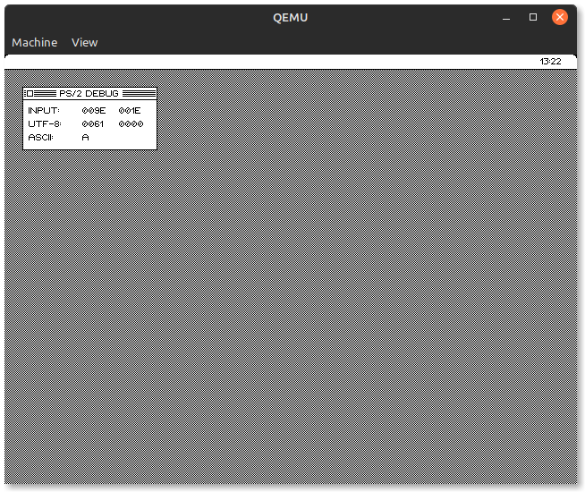
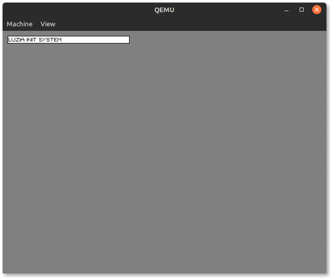
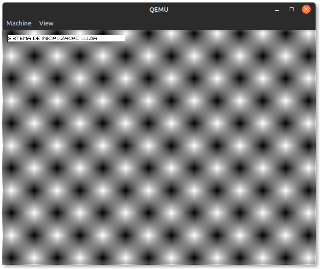

# Evolução das Versões do HUSIX

Abaixo segue em ordem cronológica as versões do HUSIX.

## v2023.2 R4622

- Implementado Controlador de Video VGA Otimizado
- Implementado Verificações para o Redraw
- Implementado Controlador de Relógio CMOS e SixPack

**Situação Atual:** Implementando Controladores de Hardware

**Tradução EN-US**

**Tradução PT-BR**

## v2023.2 R4209

- Implementado System.Drawing
- Implementado Sistema Inicial Luzia
- Implementado Controlador de Vídeo VGA
- Implementado Carregamendo de executáveis
- Implementado Carregamento de bibliotecas(Dependências)

**Situação Atual:** Implementando System.Forms e validando forma de ter um Try Catch funcional entre segmentos

**Tradução EN-US**

**Tradução PT-BR**

## v2023.2 R3522

- Implementado Leitura de arquivos no MinixFS
- Implementado Sistema de Traduções

**Situação atual:** Implementando abertura de arquivo a partir de um endereço e carregamento de um executável tipo HSX.

**Tradução EN-US**

**Tradução PT-BR**

