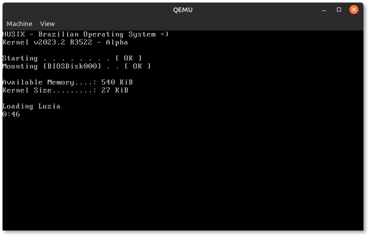
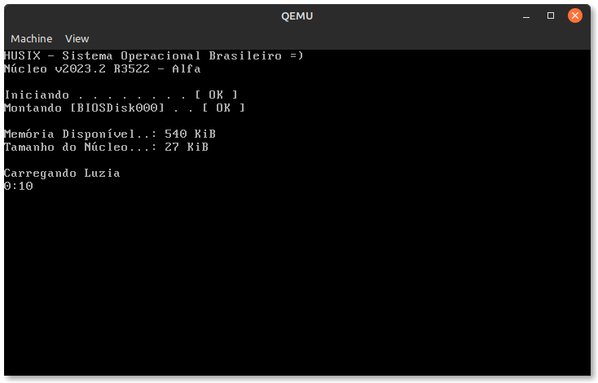

# Evolução das Versões do HUSIX

Abaixo segue em ordem cronológica as versões do HUSIX.

## v2023.2 R3522

- Implementado Leitura de arquivos no MinixFS
- Implementado Sistema de Traduções

**Situação atual:** Implementando abertura de arquivo a partir de um endereço e carregamento de um executável tipo HSX.

**Tradução EN-US**

**Tradução PT-BR**

